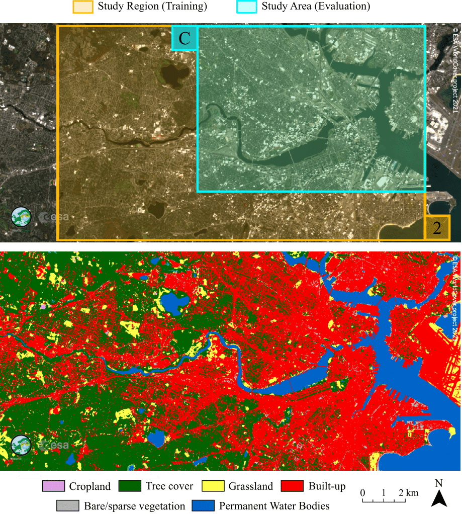

# Recursive classification of satellite imaging time series: An application to water and land cover mapping

This code has been implemented in Python 3.9. The performance of three static classification algorithms and their recursive versions is compared, including a Gaussian Mixture Model (GMM), Logistic Regression (LR) and Spectral Index Classifiers (SICs). 

Please contact the following email address if having questions regarding the code: 

## Study Area
The first experiment considers water mapping of an embankment dam in California, with one training region and two study areas for evaluation (see the following figure).

The second experiment considers land cover classification of the Charles river basin in Boston, with matching training and evaluation regions (see the following figure).

## Project Structure
The project is structured as follows.

* `README.md`

* `requirements.txt`

* `./baseline_models/`

    * `./deepwatermap_main/` contains part of the deepwatermap algorithm open 
source code shared in [this GitHub repository](https://github.com/isikdogan/deepwatermap). An `__init__.py`
file has been added to this directory to treat it as a module.
    
    * `./watnet/` contains part of the WatNet algorithm open source code shared 
in [this GitHub repository](https://github.com/xinluo2018/WatNet).

    * `benchmark.py` includes a copy of two functions from
`./deepwatermap_main/inference.py`. The `main` function has been changed with respect to the original one.

* `./tools/` contains scripts which provide useful functions.
    
    * `operations.py`

    * `path_operations.py`

    * `spectral_index.py`

* `configuration.py` contains the classes `Debug` and `Config`. Some configuration settings 
must be changed when executing the code with data that is different to the one provided by the 
authors.

* `main.py` contains the main logic and flow of the code.

* `bayesian_recursive.py` contains the core of the recursive bayesian algorithm for 
classification.

* `./plot_results/` contains scripts that can be executed to plot evaluation results. Results presented in the manuscript can be reproduced by using these files.

* `image_reader.py` contains the abstract class `ImageReader` and the class `ReadSentinel2` which
allows the user to read images from a dataset of Sentinel2 images, such as the one provided
by the authors of this code.

* `training.py` contains functions used in the training stage.

* `evaluation.py` contains functions used in the evaluation stage.

* `./trained_models/` contains `pickle` files with saved data from the   
training stage. If wanting to train the models from scratch, it should be indicated in   
the `Config` class from `configuration.py`. Data has been stored in this file because the  
training stage execution time is long.
## Installation

### Geospatial Data Abstraction Library (GDAL) Installation
Follow these instructions to [install GDAL for Python with pip on Windows](https://opensourceoptions.com/blog/how-to-install-gdal-for-python-with-pip-on-windows/)
or to [install GDAL for Python with Anaconda](https://opensourceoptions.com/blog/how-to-install-gdal-with-anaconda/) (compatible with Windows, Linux and macOS). We recommend to create
a conda environment and run the command `conda install -c conda-forge gdal` in the Anaconda prompt.

### Other Packages
There are other packages besides GDAL that need to be installed. Required packages can be installed using the Python package installer `pip`. Run the following command from the repository main folder:

<code>pip install -r requirements.txt</code>

If a module is not recognized, we recommend to install the package separately via the following commands, as suggested in the _Installation via pip and conda_ section from [these instructions](https://scikit-image.org/docs/stable/install.html), for instance in the case of `scikit-learn`:

<code>python -m pip install -U pip</code>

<code>python -m pip install -U scikit-image</code>

Also, check [this link](https://caffeinedev.medium.com/how-to-install-tensorflow-on-m1-mac-8e9b91d93706) for the installation of `tensorflow` if using macOS with the M1 chip, for which we recommend using `Miniconda`.

### Dataset
Download our dataset *Sentinel-2 Images from Oroville Dam and Charles River* from [this Zenodo link](https://zenodo.org/record/6999172#.YzWyndjMI2x) and extract the `.zip` file. 
In `configuration.py` (class `Config`), change `path_zenodo` to the path where the Zenodo folder has been stored. Images in this dataset are used for
training and evaluation. Details regarding the dataset can be found in the Zenodo link.

## Results
Results presented in the manuscript can be obtained by executing the `main_notebook.ipynb` (Jupyter Notebook) or the `main.py`file (Python script). The Zenodo folder provided by the authors contains the corresponding pickle files to be read so that results from the manuscript can be reproduced (see the `./evaluation_results/` folder from the Zenodo link) without the need to go through the training and evaluation stages. For instance, results presented in the manuscript for Study Area C are the ones presented in the following image.

If using Jupyter Notebook, we recommend to use it in a conda environment (see instructions [here](https://stackoverflow.com/questions/58068818/how-to-use-jupyter-notebooks-in-a-conda-environment)). A log file is generated in the `path_log_files` path (defined in `configuration.py`, class `Config`) for every execution of the main script. Log files contain information
regarding events in the code execution.

## References

The open source codes of the DeepWaterMap and WaterNet algorithms, used for benchmarking,
were provided by their respective authors.

* DeepWaterMap [(see the GitHub repository)](https://github.com/isikdogan/deepwatermap), by 
L. F. Isikdogan, A.C. Bovik and P. Passalacqua. This algorithm for water mapping is proposed
in the following publications:
    
    * [Seeing Through the Clouds With DeepWaterMap](https://ieeexplore.ieee.org/document/8913594)

    * [Surface Water Mapping by Deep Learning](https://ieeexplore.ieee.org/document/8013683)
    
* WatNet [(see the GitHub repository)](https://github.com/xinluo2018/WatNet), by
Xin Luo, Xiaohua Tong and Zhongwen Hu. This algorithm for water mapping is proposed in the publication
[An applicable and automatic method for earth surface water mapping based on multispectral images](https://www.sciencedirect.com/science/article/pii/S0303243421001793).

## Authors
* Helena Calatrava, Signal Processing, Imaging, Reasoning and Learning (SPIRAL) at 
Northeastern University, Boston (MA).
* Bhavya Duvvuri, The Beighley Lab (Sustainable Water Resources | Resilient Wet Infrastructure) at Northeastern
University, Boston (MA).
* Haoqing Li, Signal Processing, Imaging, Reasoning and Learning (SPIRAL) at 
Northeastern University, Boston (MA).
* Ricardo Borsoi, CRAN, University of Lorraine, CNRS, Vandoeuvre-les-Nancy, F-54000, France.
* Tales Imbiariba, Signal Processing, Imaging, Reasoning and Learning (SPIRAL) at 
Northeastern University, Boston (MA).