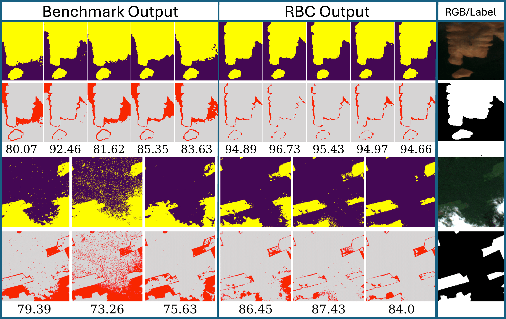

<div align="center">

  


# Recursive Bayesian Classification Framework for Satellite Imaging Time Series️
## 🌍 🛰️ An Application to Land Cover/Water Mapping and Deforestion Detection 
[comment]: https://gist.github.com/kimjisub/360ea6fc43b82baaf7193175fd12d2f7


[](https://opensource.org/licenses/MIT)


---

🚨 🚨 🚨 
<span style="color: red; font-size: 20px;">
<code>main-precomputed-results</code>: The current branch is designed for users who want to replicate the results presented in the paper by running the experiments from scratch or directly generating the figures from the paper with precomputed results.
</span>

---
We introduce the recursive Bayesian classifier (RBC), which converts any instantaneous classifier into a robust online method through a probabilistic framework that is resilient to non-informative image variations.

This repository contains the official implementation and resources for the paper: 'Recursive Classification of Satellite Imaging Time-Series: An Application to Land Cover Mapping', published in ISPRS Journal of Photogrammetry and Remote Sensing (2024).


<div align="center">
  
</div>

</div>

<p align="right"><a href="#Recursive-Bayesian-Classification-Framework-for-Satellite-Imaging-Time-Series️">⬆ Back to Top</a></p>


## 🚦 Additional Resources and Simpler Code (`main` branch)

---
For users looking for a simpler version of the code, we recommend checking out the `main` branch of this repository. This branch is ideal for researchers aiming for a minimal setup to run the RBC framework with:

- Their own data for experimentation, with or without labels:
  - **With labels**: The framework computes error maps and classification accuracy by comparing the labels to the classification results.
  - **Without labels**: The framework simply plots the classification maps.
- Our data, by downloading Version 3 of the Zenodo dataset, which contains only the images and labels necessary for running the experiments.


### Current Branch: `main-precomputed-results`

This branch is designed for users who want to replicate the results presented in the paper using our dataset, available in Zenodo Versions 3 and 4. Here’s how it works:

- **Zenodo Version 3**:
  - Contains the necessary Sentinel-2 images and data for running experiments from scratch.
  
- **Zenodo Version 4**:
  - Includes everything from Version 3, plus precomputed results. These results allow for faster reproduction of the figures and findings presented in the paper without requiring computationally expensive simulations.

This branch supports both approaches:
1. **Run experiments from scratch** using our data from either Version 3 or 4.
2. **Directly regenerate paper figures** by leveraging the precomputed results included in Zenodo Version 3.

<p align="right"><a href="#Recursive-Bayesian-Classification-Framework-for-Satellite-Imaging-Time-Series️">⬆ Back to Top</a></p>

## 🚀 Getting Started

---
### 1. Install Required Dependencies
Begin by completing the steps outlined in the Installation section to set up the required environment and dependencies.

### 2. Configure Parameters
Edit the `configuration.py` file to customize the parameters for your specific use case. Here’s what you need to adjust:
- **Set the Zenodo Path**: update `Config.path_zenodo` to point to the folder where you stored the downloaded Zenodo dataset.
- **Download DeepWaterMap Checkpoints** from [DeepWaterMap GitHub Repository](https://github.com/isikdogan/deepwatermap/tree/master/checkpoints) and set the path in `Config.path_checkpoints_deepwatermap`.  
- **Choose the Test Site** by modifying `Config.test_site` to specify which test site you want to evaluate. Example:
- Look for areas in the `Config` class marked with `TODO` comments to customize training or evaluation.  Specify whether you want to:
  - **Generate results again**: Perform training and evaluation from scratch.
  - **Reproduce figures with precomputed results**: Use precomputed results in Zenodo (Version 3).

### 3. Run the Main Script
Execute the main script to perform training and evaluation.

<p align="right"><a href="#Recursive-Bayesian-Classification-Framework-for-Satellite-Imaging-Time-Series️">⬆ Back to Top</a></p>

## 🛠️ Installation

--- 

### 1. Install GDAL (Geospatial Data Abstraction Library) 🌍 
GDAL is a required dependency for this project. Follow one of these methods to install it:
* **Windows Users:** Follow [this guide](https://opensourceoptions.com/blog/how-to-install-gdal-for-python-with-pip-on-windows/) to install GDAL with pip.
* **Anaconda Users** (Windows, Linux, macOS): Follow [this guide](https://opensourceoptions.com/blog/how-to-install-gdal-with-anaconda/). Use the following command in the Anaconda Prompt to install GDAL:

  `conda install -c conda-forge gdal` 

### 2. Install Other Python Packages
* This project requires additional Python libraries. To install them, run the following command from the repository's root directory:

  <code>pip install -r requirements.txt</code>

* If you encounter issues with unrecognized modules, consider installing problematic packages separately as suggested in the _Installation via pip and conda_ section from [this guide](https://scikit-image.org/docs/stable/install.html). For example:

  <code>python -m pip install -U pip python -m  </code>
  
  <code> pip install -U scikit-image</code>

* **Install TensorFlow for macOS (M1/M2 chips):** Follow [this detailed guide](https://caffeinedev.medium.com/how-to-install-tensorflow-on-m1-mac-8e9b91d93706). Using Miniconda is highly recommended for compatibility.

### 3. Download the Dataset from Zenodo (Version 3, specific to this GitHub branch)
The dataset *RBC-SatImg: Sentinel-2 Imagery and WatData Labels for Water Mapping* is available for download from [Zenodo](https://zenodo.org/record/12345678). Version 3 of this dataset supports the replication of results presented in the paper and includes:

#### Contents
1. **Sentinel-2 time-series imagery**:
   - Oroville Dam (CA, USA) and Charles River (Boston, MA, USA) for water mapping.
   - Amazon Rainforest (Brazil) for deforestation detection.
   
2. **RBC-WatData dataset**:
   - Manually generated water mapping labels for Oroville Dam and Charles River regions.
   - Suited for multitemporal land cover and water mapping research, accounting for dynamic label evolution over time.

3. **Pre-computed results** for reproduction of paper figures:
   - Instantaneous classification results for various methods (e.g., GMM, LR, SIC, WN, DWM).
   - Posterior results using the Recursive Bayesian Classifier (RBC) framework.
   - Sensitivity analysis results.

4. **Amazon Rainforest imagery and labels** from the MultiEarth Challenge dataset for deforestation experiments.

#### Setup Instructions
1. **Download the dataset**:
   - Retrieve the dataset from the [Zenodo link](https://zenodo.org/record/12345678) and extract the `.zip` file.
   
2. **Configure paths**:
   - Update the `path_zenodo` attribute in the `Config` class within `configuration.py` to point to the extracted folder location.
   
3. **Dataset Usage**:
   - Sentinel-2 imagery is used for training and evaluation.
   - Pre-computed results in `./evaluation_results/` allow reproducing figures and findings in the paper without re-running computationally expensive simulations.
<p align="right"><a href="#Recursive-Bayesian-Classification-Framework-for-Satellite-Imaging-Time-Series️">⬆ Back to Top</a></p>

## 🌍  Study Areas

---
The paper examines three geographical regions using Sentinel-2 satellite data to test the Recursive Bayesian Classifier (RBC) framework:

1. **Oroville Dam, California, USA**  
   - **Focus**: Water mapping of a reservoir and downstream river.
   - **Challenges**: Seasonal water level changes, ripples, and solar angle variations that create artifacts in imagery.  
   - **Labels**: Manually generated water mapping labels were created for evaluation due to the lack of pre-existing labeled time-series data.

<div align="center">

</div>

2. **Charles River Basin, Massachusetts, USA**  
   - **Focus**: Water mapping of urban rivers and harbor areas.
   - **Challenges**: Cyanobacterial blooms, reflective surfaces from buildings, and seasonal variations affecting classification accuracy.  
   - **Labels**: Manually generated water mapping labels were also created here for evaluation.

<div align="center">

</div>

3. **Amazon Rainforest, Brazil**  
   - **Focus**: Deforestation detection.  
   - **Challenges**: High cloud coverage and significant temporal spectral variability of vegetated and deforested areas.  
   - **Labels**: Existing deforestation labels were available from the MultiEarth Challenge dataset, removing the need for manual label generation in this case.

<div align="center">

</div>

### Additional Note

While the **deforestation labels** for the Amazon rainforest were sourced from the MultiEarth dataset, we manually generated **water mapping labels** for the Oroville Dam and Charles River areas. These labels are included in the publicly available Zenodo dataset to address the lack of open-source labeled data for time-series satellite analysis.
<div align="center">

</div>
<p align="right"><a href="#Recursive-Bayesian-Classification-Framework-for-Satellite-Imaging-Time-Series️">⬆ Back to Top</a></p>

## 🙏 Acknowledgements

---
This work has been partially supported by the National Geographic Society under grant NGS-86713T-21, the National Science Foundation under Awards ECCS-1845833 and CCF-2326559, and the National Aeronautics and Space Administration under Award 80NSSC20K0742.

<p align="right"><a href="#Recursive-Bayesian-Classification-Framework-for-Satellite-Imaging-Time-Series️">⬆ Back to Top</a></p>


## 🤝 Contributions

---

We welcome your contributions! Here are some ways to get involved:

1. **Run the RBC Framework with Your Data**: Use the simpler `main` branch to test the framework with your own labeled or unlabeled datasets.  
2. **Try Your Instantaneous Classifiers**: Convert your classifiers into robust recursive ones using the RBC framework, which adapts dynamically to non-informative image variations.  
3. **Improve and Extend**: Optimize the code, fix bugs, or share unique use cases.

If you do so, don't hesitate to contact us to share your results or discuss your contributions!

<p align="right"><a href="#Recursive-Bayesian-Classification-Framework-for-Satellite-Imaging-Time-Series️">⬆ Back to Top</a></p>


## 📝 Citing this Paper

---

If you use this code or dataset in your research, please cite [our paper](https://www.sciencedirect.com/science/article/pii/S0924271624003381):

```
@article{calatrava2024recursive,
  title={Recursive classification of satellite imaging time-series: An application to land cover mapping},
  author={Calatrava, Helena and Duvvuri, Bhavya and Li, Haoqing and Borsoi, Ricardo and Beighley, Edward and Erdo{\u{g}}mu{\c{s}}, Deniz and Closas, Pau and Imbiriba, Tales},
  journal={ISPRS Journal of Photogrammetry and Remote Sensing},
  volume={218},
  pages={447--465},
  year={2024},
  publisher={Elsevier}
}
```

<p align="right"><a href="#Recursive-Bayesian-Classification-Framework-for-Satellite-Imaging-Time-Series️">⬆ Back to Top</a></p>


## 📖 References

---

[1] Helena Calatrava, Bhavya Duvvuri, Haoqing Li, Ricardo Borsoi, Edward Beighley, Deniz Erdoğmuş, Pau Closas, Tales Imbiriba. ["Recursive classification of satellite imaging time-series: An application to land cover mapping."](https://www.sciencedirect.com/science/article/pii/S0924271624003381) *ISPRS Journal of Photogrammetry and Remote Sensing*, Volume 218, Pages 447-465, 2024. Publisher: Elsevier.

### Deep Learning Algorithms Used for Benchmarking

The open source codes of the DeepWaterMap and WaterNet algorithms, used for benchmarking,
were provided by their respective authors:

[2] DeepWaterMap [(see the GitHub repository)](https://github.com/isikdogan/deepwatermap), by 
L. F. Isikdogan, A.C. Bovik and P. Passalacqua. This algorithm for water mapping is proposed
in the publications [Seeing Through the Clouds With DeepWaterMap](https://ieeexplore.ieee.org/document/8913594),
and [Surface Water Mapping by Deep Learning](https://ieeexplore.ieee.org/document/8013683).
    
[3] WatNet [(see the GitHub repository)](https://github.com/xinluo2018/WatNet), by
Xin Luo, Xiaohua Tong and Zhongwen Hu. This algorithm for water mapping is proposed in the publication
[An applicable and automatic method for earth surface water mapping based on multispectral images](https://www.sciencedirect.com/science/article/pii/S0303243421001793).

<p align="right"><a href="#Recursive-Bayesian-Classification-Framework-for-Satellite-Imaging-Time-Series️">⬆ Back to Top</a></p>

## 👩‍💻 Contact

---
For inquiries regarding the code, please use the email address below:  


### Authors and Affiliations
Helena Calatrava<sup>1</sup>, Bhavya Duvvuri<sup>2</sup>, Haoqing Li<sup>1</sup>, Ricardo Borsoi<sup>3</sup>, Tales Imbiriba<sup>1,4</sup>, Edward Beighley<sup>2</sup>, Deniz Erdogmus<sup>1</sup>, Pau Closas<sup>1</sup>  


<sup>1</sup> **SPIRAL (Signal Processing, Imaging, Reasoning, and Learning)**  
Northeastern University, Boston, MA, USA  

<sup>2</sup> **The Beighley Lab (Sustainable Water Resources & Resilient Wet Infrastructure)**  
Northeastern University, Boston, MA, USA  

<sup>3</sup> **CRAN, University of Lorraine, CNRS**  
Vandoeuvre-les-Nancy, F-54000, France  

<sup>4</sup> **University of Massachusetts Boston (Department of Computer Science)**  
Boston, MA, USA  

<p align="right"><a href="#Recursive-Bayesian-Classification-Framework-for-Satellite-Imaging-Time-Series️">⬆ Back to Top</a></p>
